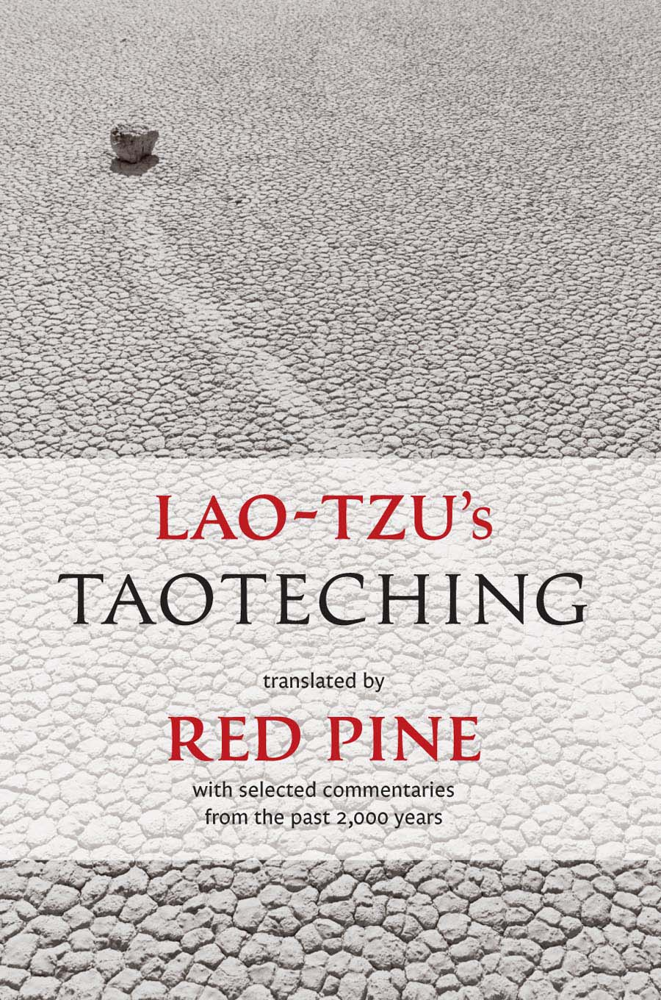

# دائو د جینگ لائوتزو (Lao-tzu's Taoteching)

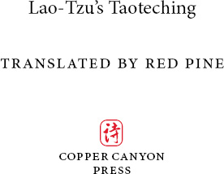

*با گزیده‌ای از تفسیرهای دو هزار سال گذشته*

*ترجمه و شرح از بیل پورتر (Bill Porter / Red Pine)*

---

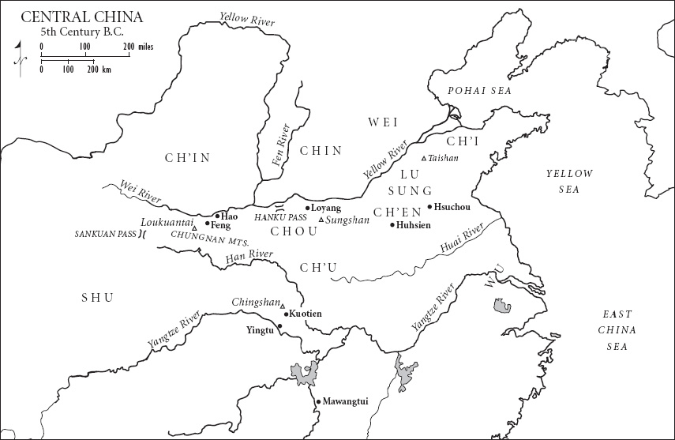

## پیش‌گفتار ویرایش بازنگری‌شده (Preface to the Revised Edition)

*(متن ترجمه فارسی پیش‌گفتار در این قسمت قرار می‌گیرد)*

## مقدمه ویرایش ۱۹۹۶ (Introduction to the 1996 Edition)

*(متن ترجمه فارسی مقدمه همراه با نمادها و تصاویر در این قسمت قرار می‌گیرد)*

### تصاویر و نمادهای مقدمه:
- نویسه دائو: 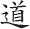
- دو بخش نویسه: سر 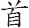 و رفتن 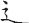
- نشان تای‌چی‌تو (یین و یانگ): 

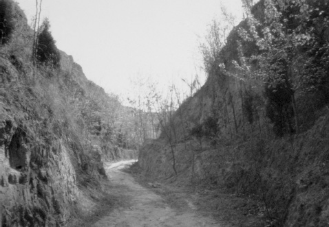
*گذرگاه هانکو (Hanku Pass)*

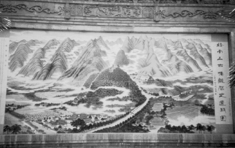
*تصویر لوکوان‌تای روی کاشی‌ها (Loukuantai)*

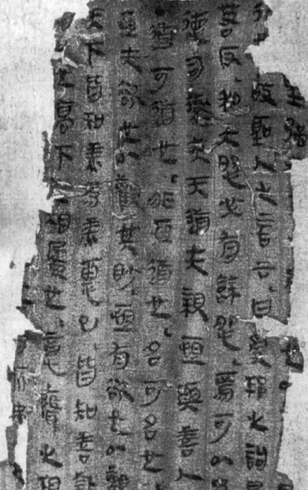
*نسخه الف ماوانگ‌دوی (Mawangtui Text A)*

---

## متن دائو د جینگ (Lao-tzu's Taoteching)

### بخش 1 (Verse 1)

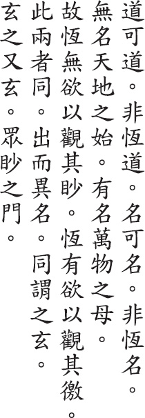

*(ترجمه فارسی بند و تفسیرها)*

### بخش 2 (Verse 2)

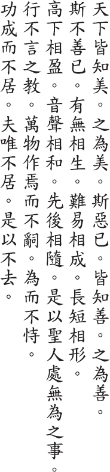

*(ترجمه فارسی بند و تفسیرها)*

### بخش 3 (Verse 3)

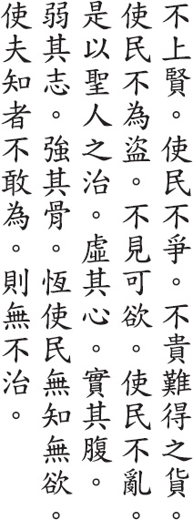

*(ترجمه فارسی بند و تفسیرها)*

### بخش 4 (Verse 4)

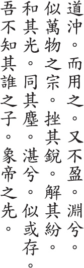

*(ترجمه فارسی بند و تفسیرها)*

### بخش 5 (Verse 5)

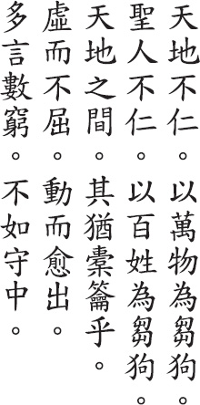

*(ترجمه فارسی بند و تفسیرها)*

### بخش 6 (Verse 6)

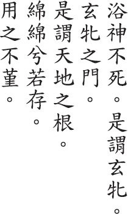

*(ترجمه فارسی بند و تفسیرها)*

### بخش 7 (Verse 7)

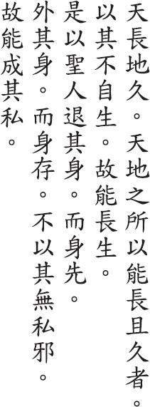

*(ترجمه فارسی بند و تفسیرها)*

### بخش 8 (Verse 8)

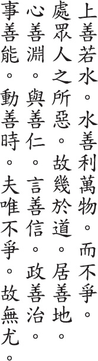

*(ترجمه فارسی بند و تفسیرها)*

### بخش 9 (Verse 9)

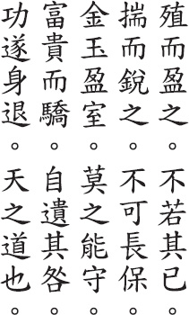

*(ترجمه فارسی بند و تفسیرها)*

### بخش 10 (Verse 10)

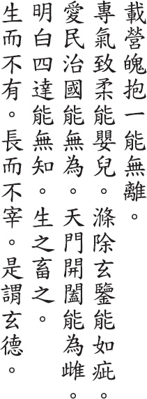

*(ترجمه فارسی بند و تفسیرها)*

### بخش 11 (Verse 11)

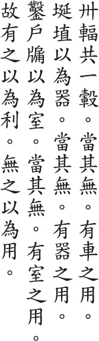

*(ترجمه فارسی بند و تفسیرها)*

### بخش 12 (Verse 12)

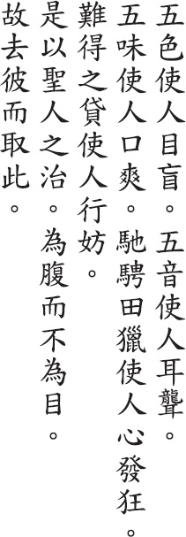

*(ترجمه فارسی بند و تفسیرها)*

### بخش 13 (Verse 13)

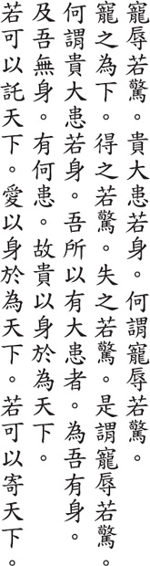

*(ترجمه فارسی بند و تفسیرها)*

### بخش 14 (Verse 14)

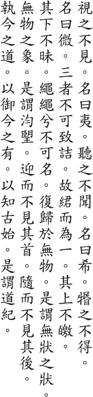

*(ترجمه فارسی بند و تفسیرها)*

### بخش 15 (Verse 15)

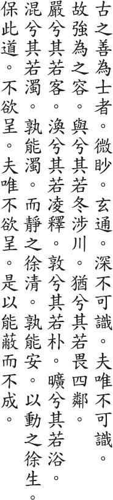

*(ترجمه فارسی بند و تفسیرها)*

### بخش 16 (Verse 16)

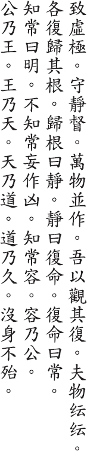

*(ترجمه فارسی بند و تفسیرها)*

### بخش 17 (Verse 17)

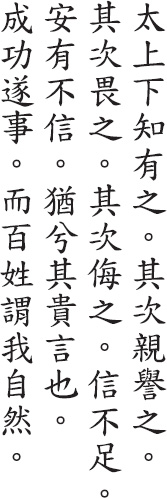

*(ترجمه فارسی بند و تفسیرها)*

### بخش 18 (Verse 18)

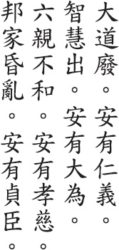

*(ترجمه فارسی بند و تفسیرها)*

### بخش 19 (Verse 19)

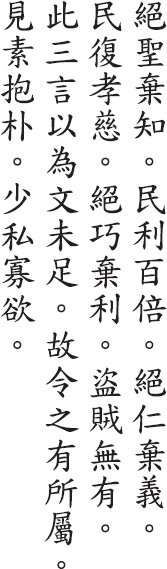

*(ترجمه فارسی بند و تفسیرها)*

### بخش 20 (Verse 20)

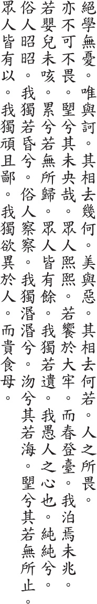

*(ترجمه فارسی بند و تفسیرها)*

### بخش 21 (Verse 21)

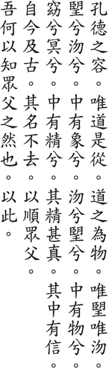

*(ترجمه فارسی بند و تفسیرها)*

### بخش 22 (Verse 22)

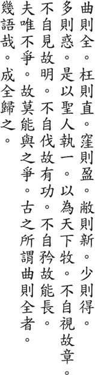

*(ترجمه فارسی بند و تفسیرها)*

### بخش 23 (Verse 23)

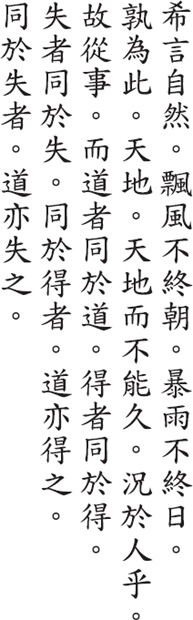

*(ترجمه فارسی بند و تفسیرها)*

### بخش 24 (Verse 24)

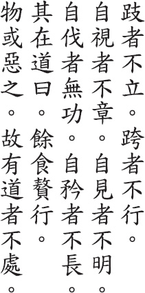

*(ترجمه فارسی بند و تفسیرها)*

### بخش 25 (Verse 25)

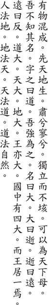

*(ترجمه فارسی بند و تفسیرها)*

### بخش 26 (Verse 26)

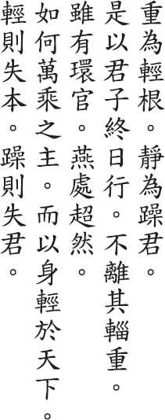

*(ترجمه فارسی بند و تفسیرها)*

### بخش 27 (Verse 27)

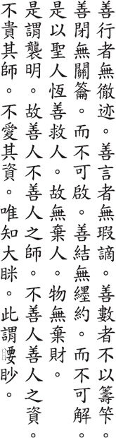

*(ترجمه فارسی بند و تفسیرها)*

### بخش 28 (Verse 28)

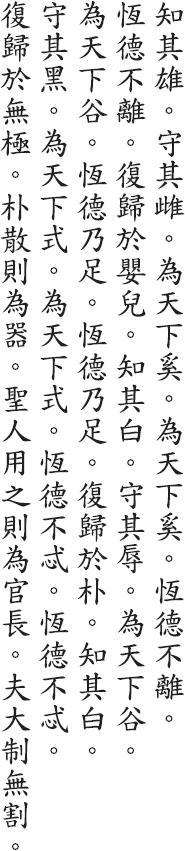

*(ترجمه فارسی بند و تفسیرها)*

### بخش 29 (Verse 29)

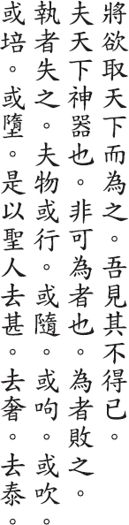

*(ترجمه فارسی بند و تفسیرها)*

### بخش 30 (Verse 30)

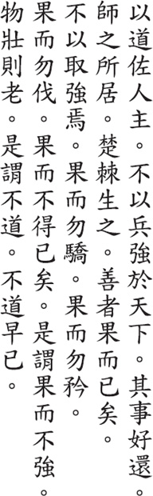

*(ترجمه فارسی بند و تفسیرها)*

### بخش 31 (Verse 31)

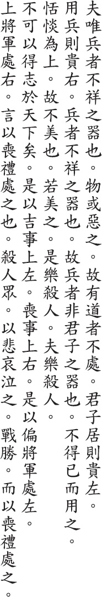

*(ترجمه فارسی بند و تفسیرها)*

### بخش 32 (Verse 32)

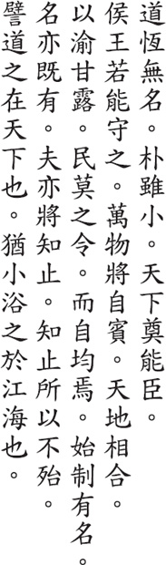

*(ترجمه فارسی بند و تفسیرها)*

### بخش 33 (Verse 33)

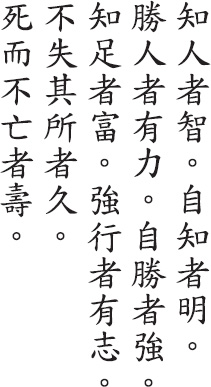

*(ترجمه فارسی بند و تفسیرها)*

### بخش 34 (Verse 34)

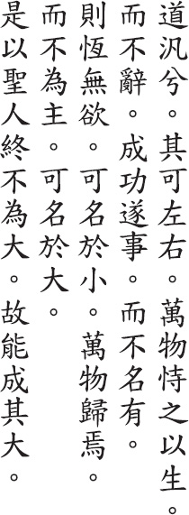

*(ترجمه فارسی بند و تفسیرها)*

### بخش 35 (Verse 35)

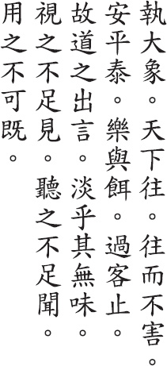

*(ترجمه فارسی بند و تفسیرها)*

### بخش 36 (Verse 36)

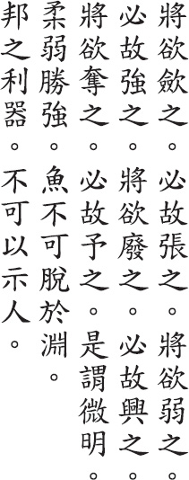

*(ترجمه فارسی بند و تفسیرها)*

### بخش 37 (Verse 37)

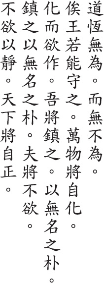

*(ترجمه فارسی بند و تفسیرها)*

### بخش 38 (Verse 38)

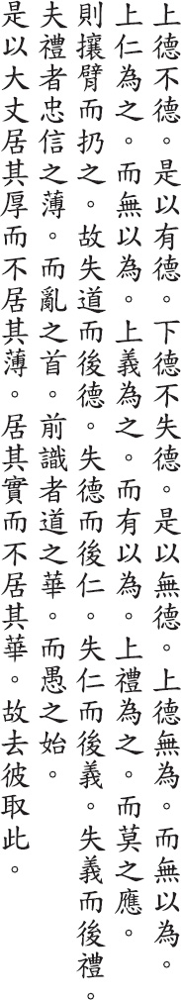

*(ترجمه فارسی بند و تفسیرها)*

### بخش 39 (Verse 39)

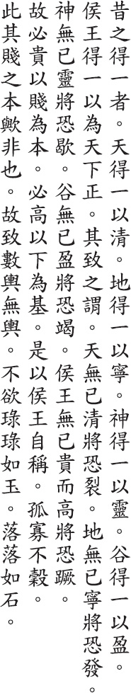

*(ترجمه فارسی بند و تفسیرها)*

### بخش 40 (Verse 40)

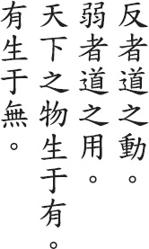

*(ترجمه فارسی بند و تفسیرها)*

### بخش 41 (Verse 41)

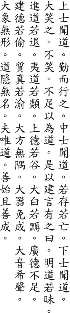

*(ترجمه فارسی بند و تفسیرها)*

### بخش 42 (Verse 42)

*(ترجمه فارسی بند و تفسیرها)*

### بخش 43 (Verse 43)

*(ترجمه فارسی بند و تفسیرها)*

### بخش 44 (Verse 44)

*(ترجمه فارسی بند و تفسیرها)*

### بخش 45 (Verse 45)

*(ترجمه فارسی بند و تفسیرها)*

### بخش 46 (Verse 46)

*(ترجمه فارسی بند و تفسیرها)*

### بخش 47 (Verse 47)

*(ترجمه فارسی بند و تفسیرها)*

### بخش 48 (Verse 48)

*(ترجمه فارسی بند و تفسیرها)*

### بخش 49 (Verse 49)

*(ترجمه فارسی بند و تفسیرها)*

### بخش 50 (Verse 50)

*(ترجمه فارسی بند و تفسیرها)*

### بخش 51 (Verse 51)

*(ترجمه فارسی بند و تفسیرها)*

### بخش 52 (Verse 52)

*(ترجمه فارسی بند و تفسیرها)*

### بخش 53 (Verse 53)

*(ترجمه فارسی بند و تفسیرها)*

### بخش 54 (Verse 54)

*(ترجمه فارسی بند و تفسیرها)*

### بخش 55 (Verse 55)

*(ترجمه فارسی بند و تفسیرها)*

### بخش 56 (Verse 56)

*(ترجمه فارسی بند و تفسیرها)*

### بخش 57 (Verse 57)

*(ترجمه فارسی بند و تفسیرها)*

### بخش 58 (Verse 58)

*(ترجمه فارسی بند و تفسیرها)*

### بخش 59 (Verse 59)

*(ترجمه فارسی بند و تفسیرها)*

### بخش 60 (Verse 60)

*(ترجمه فارسی بند و تفسیرها)*

### بخش 61 (Verse 61)

*(ترجمه فارسی بند و تفسیرها)*

### بخش 62 (Verse 62)

*(ترجمه فارسی بند و تفسیرها)*

### بخش 63 (Verse 63)

*(ترجمه فارسی بند و تفسیرها)*

### بخش 64 (Verse 64)

*(ترجمه فارسی بند و تفسیرها)*

### بخش 65 (Verse 65)

*(ترجمه فارسی بند و تفسیرها)*

### بخش 66 (Verse 66)

*(ترجمه فارسی بند و تفسیرها)*

### بخش 67 (Verse 67)

*(ترجمه فارسی بند و تفسیرها)*

### بخش 68 (Verse 68)

*(ترجمه فارسی بند و تفسیرها)*

### بخش 69 (Verse 69)

*(ترجمه فارسی بند و تفسیرها)*

### بخش 70 (Verse 70)

*(ترجمه فارسی بند و تفسیرها)*

### بخش 71 (Verse 71)

*(ترجمه فارسی بند و تفسیرها)*

### بخش 72 (Verse 72)

*(ترجمه فارسی بند و تفسیرها)*

### بخش 73 (Verse 73)

*(ترجمه فارسی بند و تفسیرها)*

### بخش 74 (Verse 74)

*(ترجمه فارسی بند و تفسیرها)*

### بخش 75 (Verse 75)

*(ترجمه فارسی بند و تفسیرها)*

### بخش 76 (Verse 76)

*(ترجمه فارسی بند و تفسیرها)*

### بخش 77 (Verse 77)

*(ترجمه فارسی بند و تفسیرها)*

### بخش 78 (Verse 78)

*(ترجمه فارسی بند و تفسیرها)*

### بخش 79 (Verse 79)

*(ترجمه فارسی بند و تفسیرها)*

### بخش 80 (Verse 80)

*(ترجمه فارسی بند و تفسیرها)*

### بخش 81 (Verse 81)

*(ترجمه فارسی بند و تفسیرها)*

## واژه‌نامه و راهنمای نام‌ها (Glossary)

CHANG TAO-LING / ZHANG DAOLING / 

*CHANKUOTSE* / *ZHANGUOZE* / 

CHAO CHIH-CHIEN / ZHAO ZHIJIAN / 

CH’EN KU-YING / CHEN GUYING / 

CH’ENG CHU / CHENG ZHU / 

CH’ENG HSUAN-YING / CHENG XUANYING / 

CHENG LIANG-SHU / ZHENG LIANGSHU / 

CHIANG HSI-CH’ANG / JIANG XICHANG / 

CH’IANG SSU-CH’I / CHIANG SIQI / 

CHIAO HUNG / JIAO HONG / 

CHIEH / JIE / 

CHINGFU / JINGFU / 

CHINGLUNG / JINGLONG / 

*CHINJENMING* / *JINRENMING* / 

CHU CH’IEN-CHIH / ZHU QIANZHI / 

CHU TI-HUANG / ZHU DIHUANG / 

CH’U YUAN / QU YUAN / 

CHUANG-TZU / ZHUANGZI / 

*CHUNGYUNG* / *ZHONGYONG* / 

CONFUCIUS / 

DUKE AI / 

DUKE WEN OF CHIN / JIN / 

FAN YING-YUAN / FAN YINGYUAN / 

FIVE EMPERORS / 

FU HSI / FU XI / 

FUYI / 

HAN FEI / 

HANKU / HANGU PASS / 

HO-SHANG KUNG / HESHANG GONG / 

*HOUHANSHU* / 

HSI T’UNG / XI TONG / 

HSIN TU-TZU / XIN DUZI / 

*HSISHENGCHING* / *XISHENGJING* 

HSU YUNG-CHANG / XU YONGZHANG / 

HSUAN-TSUNG / XUANZONG / 

HSUEH HUI / XUE HUI / 

HSUN-TZU / XUNZI / 

HU SHIH / HU SHI / 

HUAI-NAN-TZU / HUAINANZI / 

HUANG MAO-TS’AI / HUANG MAOCAI / 

HUANG YUAN-CHI / HUANG YUANJI / 

HUANG-TI / HUANGDI / 

*HUANGTI NEICHING* / *HUANGDI NEIJING* / 

HUHSIEN / HUXIAN / 

HUI-TSUNG / HUIZONG / 

JEN CHI-YU / REN JIYU / 

JEN FA-JUNG / REN FARONG / 

KAO HENG / GAO HENG / 

KAO YEN-TI / GAO YENDI / 

KING HSIANG / XIANG OF LIANG / 

KU HSI-CH’OU / GU XICHOU / 

KUAN LUNG-FENG / GUAN LONGFENG / 

KUAN-TZU / GUANZI / 

KUMARAJIVA / 

KUO YEN / GUO YEN / 

KUOTIEN / GUODIAN / 

*KUOYU* / *GUOYU* / 

*KUSHIHYUAN* / *GUSHIYUAN* / 

LI HSI-CHAI / LI XIZHAI / 

LI HUNG-FU / LI HONGFU / 

LI JUNG / LI RONG / 

LI YUEH / LI YUE / 

*LICHI* / *LIJI* / 

LIEH-TZU / LIEZI / 

LIN HSI-YI / LIN XIYI / 

LIU CH’EN-WENG / 

LIU CHING / LIU JING / 

LIU CHUNG-P’ING / LIU ZHONGPING / 

LIU PANG / LIU BANG / 

LIU SHIH-LI / LIU SHILI / 

LIU SHIH-P’EI / LIU SHIPEI / 

LO CHEN-YU / LO ZHENYU / 

LU HSI-SHENG /LU XISHENG / 

LU HUI-CH’ING /LU HUIQING / 

LU NUNG-SHIH / LU NONGSHI / 

LU TUNG-PIN / LU DONGBIN / 

*LUSHIH CHUNCHIU* / *LUSHI QUNQIU* / 

MA HSU-LUN / MA XULUN / 

MAWANGTUI / MAWANGDUI / 

MENCIUS / 

MING T’AI-TSU / MING TAIZU / 

MO-TZU / MOZI / 

MOU-TZU / MOUZI / 

PAO-TING / BAODING / 

PI KAN / BI GAN / 

PI YUAN / BI YUAN / 

PO-TSUNG / 

*SHANHAICHING* / *SHANHAIJING* / 

SHAO JUO-YU / SHAO RUOYU / 

SHEN NUNG / SHEN NONG / 

*SHIHCHING* / *SHIJING* / 

*SHUCHING* / *SHUJING* / 

SHUN / 

*SHUOWEN* / 

*SHUOYUAN* / 

SSU-MA CH’IEN / SIMA QIAN / 

SSU-MA KUANG / SIMA GUANG / 

SU CH’E / SU CHE / 

SUICHOU / SUIZHOU / 

SUNG CH’ANG-HSING / SONG CHANGXING / 

SUN-TZU / 

SUOTAN / SUODAN / 

SWEET DEW / 

*TAHSUEH* / *DAXUE* / 

TE-CH’ING / DEQING / 

THREE SOVEREIGNS / 

TS’AO TAO-CH’UNG / CAO DAOCHONG / 

TSENG-TZU / ZENGZI / 

*TSOCHUAN* / *ZUOZHUAN* / 

TU ER-WEI / DU ERWEI / 

TU TAO-CHIEN / DU DAOJIAN / 

TUNG SSU-CHING / DONG SIJING / 

TUNHUANG / DUNHUANG / 

TZU-SSU / ZISI / 

WANG AN-SHIH / WANG ANSHI / 

WANG CHEN / WANG ZHEN / 

WANG NIEN-SUN / WANG NIANSUN / 

WANG P’ANG / WANG PANG / 

WANG PI / WANG BI / 

WANG TAO / WANG DAO / 

WANG WU-CHIU / WANG WUJIU / 

WEI YUAN / 

WEN-TZU / WENZI / 

WU CH’ENG / WU CHENG / 

YANG / 

YANG HSIUNG / YANG XIUNG / 

YAO NAI / 

YELLOW EMPEROR / 

YEN FU / 

YEN LING-FENG / YEN LINGFENG / 

YEN TSUN / YEN ZUN / 

*YENTIEHLUN* / *YENTIELUN* / 

*YICHING / YIJING* / 

*YICHING CHITZU* / *YIJING JIZI* / 

YIN */* 

YIN HSI / YIN XI / 

YIN WEN / 

YU JUO / 

*YUNCHI CHICHIEN* / *YUNJI QIJIAN* / 

## درباره مترجم (About the Translator)

*(شرح حال رِد پاین / بیل پورتر)*

## نشان‌ها و تقدیر (Colophon)

